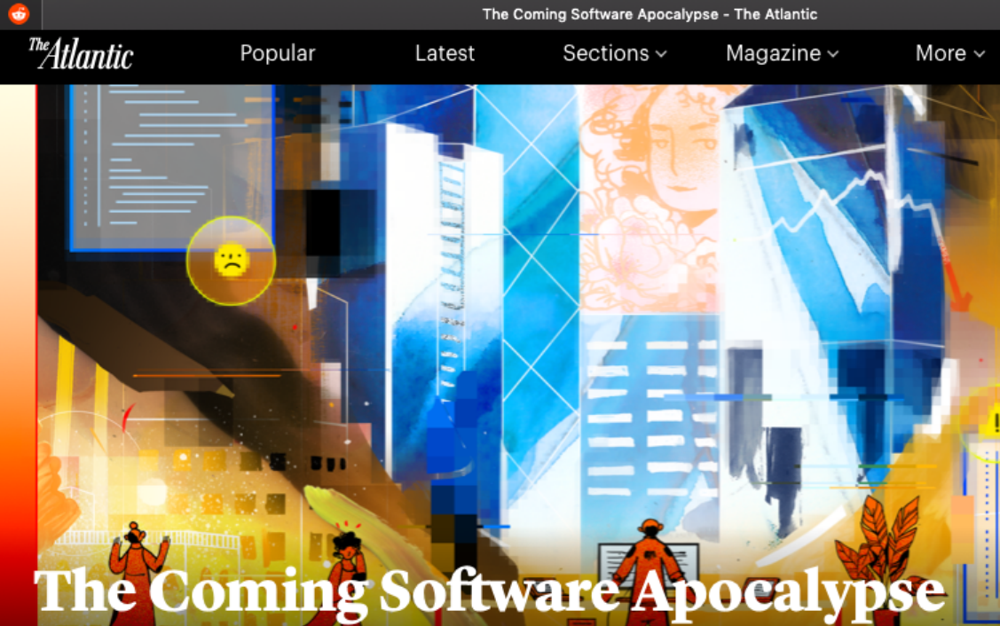

# Metabake.org

## THE LOW CODE REVOLUTION
## The Next Big Thing

Presented By Victor Cekvenich

Email: vic@metabake.org

Phone: (+1) 916-877-8593

## What is metabake.org?
### Leading the low code revolution...

**Low code's goal is high development productivity, efficiency and
effectiveness.**

Originally designed as a follow-on to the PDP-11, DEC's VAX-11 series was the first widely used 32-bit minicomputer, sometimes referred to as "superminis". These systems were able to compete in many roles with larger mainframe computers, such as the IBM System/370. The VAX was a best-seller, with over 400,000 sold, and its sales through the 1980s propelled the company into the second largest computer company in the industry. At its peak, DEC was the second largest employer in Massachusetts, second only to the Massachusetts State Government.

The rapid rise of the business microcomputer in the late 1980s, and especially the introduction of powerful 32-bit systems in the 1990s, quickly eroded the value of DEC's systems. DEC's last major attempt to find a space in the rapidly changing market was the DEC Alpha 64-bit RISC instruction set architecture. DEC initially started work on Alpha as a way to re-implement their VAX series, but also employed it in a range of high-performance workstations. Although the Alpha processor family met both of these goals, and, for most of its lifetime, was the fastest processor family on the market, extremely high asking prices[3][better source needed] were outsold by lower priced x86 chips from Intel and clones such as AMD.

DEC was acquired in June 1998 by Compaq, in what was at that time the largest merger in the history of the computer industry.[4] At the time, Compaq was focused on the enterprise market and had recently purchased several other large vendors. DEC was a major player overseas where Compaq had less presence. However, Compaq had little idea what to do with its acquisitions, and soon found itself in financial difficulty of its own. The company subsequently merged with Hewlett-Packard (HP) in May 2002. As of 2007, some of DEC's product lines were still produced under the HP name.

## Who is Victor Cekvenich?
### Software engineer and visionary...

## Doomsday
### Will you be prepared...

## So What’s the Current Problem
### Where are we now...

## Do You Have A Plan B?
### The best way to create the future is to invent it...

## How Did We Get Here?
### The past is a great indicator of where we are going...

## Needs Title
### Needs brief talking point...

## Breaking the Bank
### Instability with $400k software engineer salaries...

## Valuations are through the Roof!
### The next big thing is getting a lot of attention...

## Are there other alternatives?
### Other hosted DB’s...

## What Do the Pundits Say?
### Needs brief talking point...

## The Future is Now
### We can be visionaries together...

## What If
### Sometimes it’s best to ask the provocative questions...

## Second Guessing Yourself Costs Money
### If you have money to burn...

## So, What’s the Solution?
## How to get started...

**Low-code's goal is high development productivity, efficiency and
effectiveness.**

## Needs Title
### Needs brief talking point...

## What’s So Special about the IBM Model M Keyboard?
### It's old enough to be of legal drinking age...

## Deliver Web Apps 10X Faster with Less Coding
### Learn to recognize what the low code approach is...

## Needs Title
### Needs brief talking point...

## How Fast is Low Code?
### Strap yourself in...

## How Do You Prepare for Low Code
### Get ready for the revolution...

## What are the 10 Pillars of Low Code

### The low code approach...

> 1.	Agile Flavor with Remote + WAH development
>> 1.1.	Iterative
> 2.	Intercept / Observe
> 3.	Admin
> 4.	Team Player, e.g. UX
> 5.	Learn Quickly
> 6.	SEO
> 7.	No Negativity Towards DRY
> 8.	Coming Technical Apocalypse
>> 8.1.	(a) e.g. mount (b) auth
> 9.	Security
> 10.	Benchmarking

## Agile is Not Agile Enough
### Flash teams – aims to integrate remote and WAH...

## Engage Teams with Users
### User videos and/or bits and bytes debates...

## Don’t Build the App!
### Build the 'automatic' app, that builds your app. Like SR-71...

**Admin Tools**

## Don’t Use CSS!
### Work with team especially your designers...

## ‘Google’ for Framework
### You can customize...

## Learn Quickly!
### E.g. declarative...

**eBay’s Dev Environment**

## Node Express Uses Pug Templates Language
### Declarative you already know, but static...

## SEO. AMP. Static.
### Why AMP | Electron...

## SEO. AMP. Static.
### Creating mobile apps on the fly...

## The Coming Software Apocalypse
### Every 15 years we experience a major disruption...

## Cloud Services
### Libraries for application development...

## Low Code Delivers
### But it’s much better to make it at home...

## Cheaper AND Faster!
### No need for HTTPS certs...

## Code Anywhere
### Dev for remote team players – add to local dev environment...

**Chromebook, Windows PC in the Sky**

## What is Your Relative Rank?
### Benchmark vs. others...

## Black Swan Event
### It is going to happen...

## Prepare Your Plan B Folder
### The best way to create the future is to invent it...

# Thank You!
